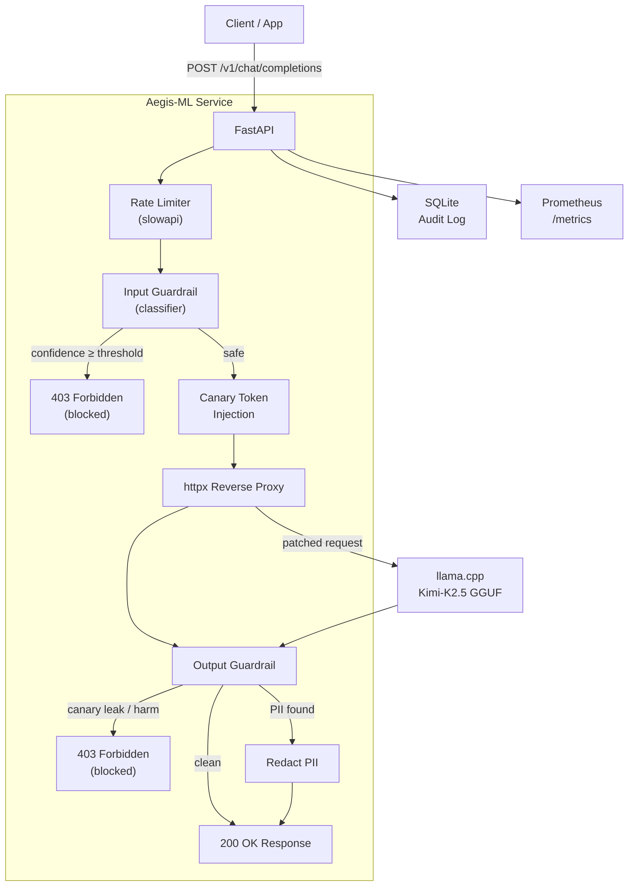

# 🛡️ Aegis-ML — LLM Firewall / Guardrails Service

> **Adversarial Prompt Injection Detector Microservice**
> A production-ready, real-time reverse proxy that protects local LLMs against prompt injection attacks, jailbreaks, and data-exfiltration attempts.

---

## What It Is

Aegis-ML is an **LLM Firewall** — a security reverse proxy that sits between your application and a locally-hosted LLM (llama.cpp, or any OpenAI-compatible endpoint). It intercepts every request and response, applying layered ML-driven guardrails to block prompt injection, jailbreaks, PII leaks, and data-exfiltration attempts.

It is **drop-in compatible** with the OpenAI API. Point your client at Aegis instead of your LLM, and nothing else changes.

---

## How It Works

Every request passes through a 6-stage pipeline:

```
Client Request
    ↓
[1] Rate Limiting          — per-IP request throttle (slowapi)
    ↓
[2] Input Classifier       — ML model scores prompt for malicious intent
                             Block (403) if malicious_prob ≥ threshold
    ↓
[3] Canary Token Injection — random 32-char token embedded in system prompt
    ↓
[4] Reverse Proxy          — forward patched request to backend LLM
    ↓
[5] Output Guardrail       — check canary echo (injection success?),
                             redact PII, filter harmful content
    ↓
[6] Audit Log              — record verdict, threat type, latency to SQLite
    ↓
Client Response (200 OK or 403 Forbidden)
```

### Defense Layers in Detail

**Input Classifier** — Extracts text from all messages (including role labels, to catch role-manipulation attacks) and runs it through an ML classifier. If `malicious_prob ≥ threshold` (default `0.70`), the request is blocked immediately — the backend LLM is never called. Any classifier exception also blocks (fail-secure).

**Canary Token System** — A cryptographically random token is injected into the system prompt as `[SYS_REF:TOKEN]` for every request. If that token appears anywhere in the model's response, it means a prompt injection succeeded in leaking the system prompt — the response is blocked and the incident is logged as a `canary_leak`.

**Output Guardrail** — Scans every LLM response for:
- Canary token echo (prompt injection confirmation)
- PII patterns: SSN, credit card numbers, emails, phone numbers, IPv4 addresses, AWS keys, private key headers
- Harmful content keywords

PII is redacted from the response; harmful content and canary leaks result in a 403 block.

**Audit Log** — Every request is logged to SQLite with: `request_id`, `client_ip`, `input_verdict`, `input_confidence`, `threat_type`, `output_verdict`, `latency_ms`. Prompt text can optionally be masked for GDPR compliance (`REDACT_PROMPTS_IN_LOGS=true`).

---

## Architecture



### Phase Progression

| Phase | Classifier | Accuracy | Latency | RAM |
|-------|-----------|----------|---------|-----|
| Phase 1 | TF-IDF + Logistic Regression | ~90-93% | <1 ms | ~50 MB |
| Phase 2 | Fine-tuned DistilBERT (4-bit QLoRA) | ~94-97% | 5-15 ms | ~400 MB |
| Phase 3 | Side-by-side comparison notebook | — | — | — |

---

## Quick Start

### Prerequisites

- Python 3.11+
- [UV](https://docs.astral.sh/uv/getting-started/installation/) (`curl -LsSf https://astral.sh/uv/install.sh | sh`)
- (Phase 2 only) CUDA-capable GPU

### 1. Install dependencies

```bash
# Base install (Phase 1 — sklearn only)
uv sync

# With HuggingFace / PyTorch (Phase 2)
uv sync --extra hf

# With dev tools + testing
uv sync --extra dev

# Everything
uv sync --all-extras
```

### 2. Configure environment

```bash
cp .env.example .env
# Edit .env — set BACKEND_URL to your llama.cpp server
```

### 3. Train Phase 1 (scikit-learn)

```bash
# Download + prepare dataset
uv run python -m training.data.prepare_dataset

# Train TF-IDF + Logistic Regression
uv run python -m training.phase1_sklearn.train

# Evaluate and see metrics
uv run python -m training.phase1_sklearn.evaluate
```

Expected output:
```
ROC-AUC          : 0.9821
F1               : 0.9312
FPR              : 3.2%       ← under 5% target ✓
Latency          : 0.4 ms/sample
Model saved to models/sklearn_classifier.joblib
```

### 4. Start the service

```bash
uv run python -m app.main
# OR
uv run aegis-serve
```

Service available at: `http://localhost:8000`
- API docs: `http://localhost:8000/docs`
- Health: `http://localhost:8000/health`
- Metrics: `http://localhost:8000/metrics`

### 5. Launch the Gradio demo UI

```bash
uv run python -m demo.gradio_ui
# Open: http://localhost:7860
```

---

## Phase 2 — Fine-tune HuggingFace Model

Train on your desktop GPU:

```bash
# Full fine-tune DistilBERT (requires ~4 GB VRAM)
uv run python -m training.phase2_hf.train --model distilbert --epochs 5

# 4-bit QLoRA (requires only ~2 GB VRAM)
uv run python -m training.phase2_hf.train --model distilbert --qlora --epochs 5

# Higher accuracy: DeBERTa-v3-small (requires ~6 GB VRAM)
uv run python -m training.phase2_hf.train --model deberta --epochs 5

# Evaluate
uv run python -m training.phase2_hf.evaluate
```

Switch the running service to use the HF model:
```bash
# In .env:
CLASSIFIER_TYPE=hf
HF_MODEL_PATH=models/hf_classifier
```

---

## Phase 3 — Comparison Notebook

```bash
uv sync --extra notebook
uv run jupyter lab notebooks/phase3_comparison.ipynb
```

The notebook produces:
- Side-by-side metrics table (F1, FPR, latency, RAM)
- Threshold tuning curves
- Confusion matrices + ROC curves
- Resource usage comparison

---

## Docker

### Build and run locally

```bash
# Phase 1 only (lightweight, ~600 MB image)
docker build -t aegis-ml .

# With HuggingFace support (~3 GB image)
docker build --build-arg EXTRAS=hf -t aegis-ml:hf .

# Run
docker run -p 8000:8000 \
  -v $(pwd)/models:/app/models:ro \
  -v $(pwd)/logs:/app/logs \
  -e BACKEND_URL=http://host.docker.internal:8080/v1/chat/completions \
  aegis-ml
```

### Docker Compose (service + demo UI)

```bash
# Copy and configure
cp .env.example .env

# Start everything
docker compose up --build

# Production (detached)
docker compose up -d --build
```

---

## Deploy to Hostinger VPS (2 vCPU / 8 GB)

### 1. Set up the VPS

```bash
# SSH in
ssh user@your-vps-ip

# Install Docker
curl -fsSL https://get.docker.com | sh
sudo usermod -aG docker $USER

# Install UV (optional — for running without Docker)
curl -LsSf https://astral.sh/uv/install.sh | sh
```

### 2. Transfer the project

```bash
# From your local machine:
rsync -avz --exclude '.venv' --exclude '__pycache__' \
  /mnt/Files/Projects/Python/Aegis-ML/ \
  user@your-vps-ip:/home/user/aegis-ml/

# Or clone from git:
git clone https://github.com/yourusername/aegis-ml.git
cd aegis-ml
```

### 3. Transfer your trained model

```bash
rsync -avz models/sklearn_classifier.joblib \
  user@your-vps-ip:/home/user/aegis-ml/models/
```

### 4. Deploy

```bash
# On the VPS:
cd /home/user/aegis-ml
cp .env.example .env
# Edit .env — set BACKEND_URL to your llama.cpp server

docker compose up -d --build

# Verify
curl http://localhost:8000/health
```

### 5. Nginx reverse proxy (optional, for HTTPS)

```nginx
server {
    listen 80;
    server_name your-domain.com;

    location / {
        proxy_pass http://localhost:8000;
        proxy_set_header Host $host;
        proxy_set_header X-Real-IP $remote_addr;
        proxy_read_timeout 120s;
    }
}
```

### Resource usage on VPS

| Component | RAM | CPU |
|-----------|-----|-----|
| FastAPI + sklearn | ~150 MB | <5% idle |
| SQLite audit DB | ~10 MB | minimal |
| Total (Phase 1) | **~200 MB** | ✓ well under 8 GB |

---

## Configuration Reference

All settings are read from `.env` (copy from `.env.example`).

| Variable | Default | Description |
|----------|---------|-------------|
| `CLASSIFIER_TYPE` | `sklearn` | `sklearn` (Phase 1) or `hf` (Phase 2) |
| `CONFIDENCE_THRESHOLD` | `0.70` | Block if `malicious_prob ≥` this value |
| `BACKEND_URL` | `http://localhost:8080/v1/chat/completions` | Your LLM endpoint |
| `BACKEND_API_KEY` | *(empty)* | Bearer token for backend auth (empty = no auth) |
| `RATE_LIMIT_PER_MINUTE` | `60` | Max requests per IP per minute |
| `SKLEARN_MODEL_PATH` | `models/sklearn_classifier.joblib` | Phase 1 model artifact |
| `HF_MODEL_PATH` | `models/hf_classifier` | Phase 2 model directory |
| `CANARY_TOKEN_LENGTH` | `32` | Length of per-request canary tokens |
| `DATABASE_URL` | `sqlite+aiosqlite:///./logs/aegis_audit.db` | Audit log database |
| `REDACT_PROMPTS_IN_LOGS` | `false` | Mask prompt text in audit logs (GDPR) |
| `LOG_LEVEL` | `INFO` | `DEBUG`, `INFO`, `WARNING`, `ERROR` |
| `HOST` / `PORT` | `0.0.0.0` / `8000` | Service bind address |

---

## Switching Between Classifiers

```bash
# .env
CLASSIFIER_TYPE=sklearn    # Phase 1 (default, fast)
CLASSIFIER_TYPE=hf         # Phase 2 (accurate, GPU recommended)
```

Then restart the service. No code changes needed.

---

## API Reference

### POST `/v1/chat/completions`

OpenAI-compatible endpoint. Drop-in replacement — just point your client here instead of OpenAI.

```bash
curl -X POST http://localhost:8000/v1/chat/completions \
  -H "Content-Type: application/json" \
  -d '{
    "model": "local-model",
    "messages": [{"role": "user", "content": "What is Python?"}]
  }'
```

**Blocked request (403):**
```json
{
  "error": {
    "message": "Request blocked by Aegis-ML guardrails.",
    "type": "guardrail_violation",
    "code": "prompt_injection_detected"
  }
}
```

### GET `/health`

```json
{
  "status": "ok",
  "classifier": "sklearn",
  "classifier_loaded": true,
  "version": "1.0.0"
}
```

### GET `/metrics`

Prometheus text format. Key metrics:

| Metric | Description |
|--------|-------------|
| `aegis_requests_total` | Total requests by verdict (allowed/blocked_input/blocked_output) |
| `aegis_request_latency_seconds` | End-to-end latency histogram |
| `aegis_classifier_latency_seconds` | Classifier inference latency |
| `aegis_canary_leaks_total` | Canary token leaks detected |
| `aegis_input_blocks_total` | Requests blocked at input |
| `aegis_output_blocks_total` | Responses blocked at output |

### GET `/audit/logs?limit=50`

Returns recent audit log entries from SQLite.

---

## Security Design

### Input Guardrail
1. Extract all message content (including role labels — catches role-manipulation attacks)
2. Run through active classifier (sklearn or HF)
3. If `confidence ≥ threshold` → return 403 immediately, no LLM call
4. **Fail-secure**: any exception → block

### Canary Token System
- Per-request cryptographically random token (UUID-grade entropy)
- Embedded in system prompt as `[SYS_REF:TOKEN]`
- If token appears in model output → successful injection detected → block response
- One-time use (consumed immediately after output check)

### Output Guardrail
1. **Canary check** — detect injection success
2. **PII redaction** — SSN, credit card, email, phone, IPv4, AWS keys, private key headers
3. **Harm filter** — keyword-based detection of clearly harmful content
4. **Fail-secure**: any exception → block

### Threshold Tuning
Default threshold: `0.70`

Lower = stricter (fewer missed injections, more false positives)
Higher = more permissive (fewer false positives, more missed injections)

The training script outputs the optimal threshold after tuning:
```
Threshold tuning → optimal threshold=0.73  FPR=3.8%
```

Update in `.env`: `CONFIDENCE_THRESHOLD=0.73`

---

## Testing

```bash
# Run all tests
uv run pytest tests/ -v

# With coverage
uv run pytest tests/ -v --cov=app --cov-report=html
```

---

## Project Structure

```
Aegis-ML/
├── app/                        # FastAPI service
│   ├── main.py                 # App factory + lifespan
│   ├── config.py               # Pydantic v2 settings
│   ├── models/
│   │   ├── schemas.py          # Pydantic schemas (OpenAI-compatible)
│   │   └── database.py         # Async SQLite audit log
│   ├── guardrails/
│   │   ├── canary.py           # Canary token generation + detection
│   │   ├── input_guard.py      # Input classifier pipeline
│   │   └── output_guard.py     # Output PII/harm filter
│   ├── classifiers/
│   │   ├── sklearn_classifier.py  # Phase 1: TF-IDF + LR
│   │   └── hf_classifier.py       # Phase 2: Fine-tuned DistilBERT
│   ├── proxy/
│   │   └── llm_proxy.py        # httpx reverse proxy to llama.cpp
│   └── api/
│       ├── routes.py           # All FastAPI route handlers
│       └── middleware.py       # Rate limiting + request logging
├── training/
│   ├── data/
│   │   ├── prepare_dataset.py  # Download + combine datasets
│   │   └── synthetic_gen.py    # Local synthetic example generator
│   ├── phase1_sklearn/
│   │   ├── train.py            # GridSearchCV + threshold tuning
│   │   └── evaluate.py         # Metrics + demo predictions
│   └── phase2_hf/
│       ├── train.py            # HF Trainer + QLoRA support
│       └── evaluate.py         # HF model evaluation
├── demo/
│   └── gradio_ui.py            # Standalone Gradio chat UI
├── notebooks/
│   └── phase3_comparison.ipynb # Side-by-side comparison
├── tests/
│   ├── test_guardrails.py      # Unit tests for guardrails
│   └── test_proxy.py           # Integration tests
├── models/                     # Trained model artifacts (gitignored)
├── logs/                       # SQLite audit DB (gitignored)
├── data/                       # Combined dataset (gitignored)
├── Dockerfile                  # UV multi-stage build
├── docker-compose.yml          # Service + demo orchestration
├── pyproject.toml              # UV project config
└── .env.example                # Environment variable template
```

---

## Portfolio Talking Points

**1. Production security architecture** — Layered defence: rate limiting → input classification → canary injection → output guardrails → audit logging. Every layer is fail-secure.

**2. ML lifecycle** — Full pipeline from dataset curation (public HF + synthetic generation) through training (Phase 1: classical ML with GridSearchCV; Phase 2: LLM fine-tuning with 4-bit QLoRA) to production serving.

**3. Metric-driven threshold tuning** — Quantified false-positive target (<5% FPR) with automated threshold discovery. Demonstrates understanding that model accuracy ≠ production safety.

**4. Modern Python stack** — UV for dependency management, Pydantic v2 for validation, async FastAPI with proper lifespan management, httpx for async HTTP, aiosqlite for non-blocking DB.

**5. Operational readiness** — Prometheus metrics, health checks, structured audit logging, Docker multi-stage build, docker-compose for local and production.

**6. Security-first thinking** — Canary tokens detect post-injection compromise. PII redaction in output prevents data leaks even from benign model misbehaviour. Configurable redaction in audit logs for compliance.

---

## License

MIT
