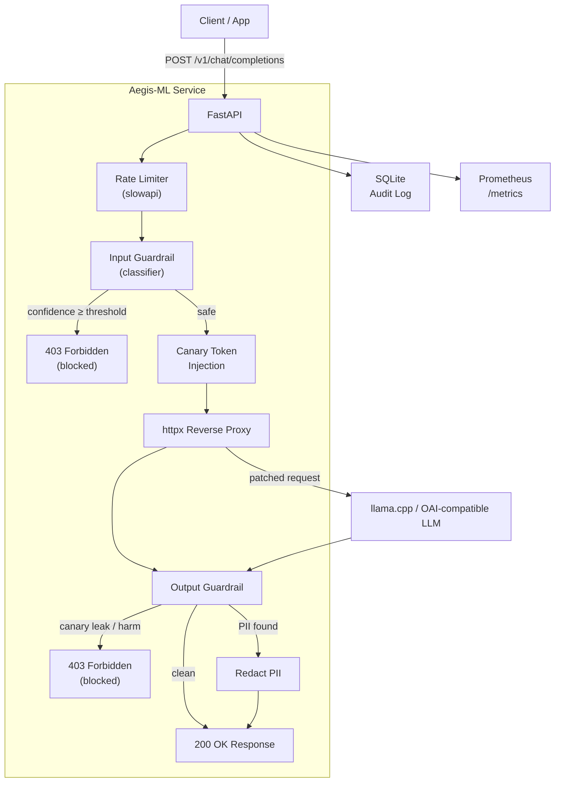

# 🛡️ Aegis-ML — LLM Firewall

> **A production-architecture reverse proxy that protects LLMs against prompt injection, jailbreaks, and data exfiltration — without changing a line of client code.**

[](https://huggingface.co/spaces/billybitcoin/aegis-ml)
[](https://python.org)
[](LICENSE)

---

## The Problem

Prompt injection is the [OWASP #1 risk for LLM applications](https://owasp.org/www-project-top-10-for-large-language-model-applications/). When a user — or malicious content in a document, API response, or tool output — can override an LLM's instructions, the model becomes a weapon against its own operator. Existing mitigations are advisory (tell the model to be careful) rather than architectural.

Aegis-ML takes an architectural approach: **intercept every request before it touches the model, classify it with an ML guardrail, and block if malicious**. The LLM never sees the attack.

---

## What It Does

Aegis-ML is an **OpenAI-compatible reverse proxy** — point your application at it instead of your LLM endpoint, and nothing else changes. Under the hood, every request flows through a 6-stage pipeline:

```
Client Request
    ↓
[1] Rate Limiting          — per-IP throttle, slowapi
    ↓
[2] Input Guardrail        — ML classifier scores the prompt
                             Block 403 if malicious_prob ≥ threshold (default 0.70)
    ↓
[3] Canary Token Injection — cryptographic token embedded in the system prompt
    ↓
[4] Reverse Proxy          — patched request forwarded to backend LLM (llama.cpp / any OAI-compatible)
    ↓
[5] Output Guardrail       — detect canary echo (injection success), redact PII, filter harmful keywords
    ↓
[6] Audit Log              — every decision written to SQLite: verdict, threat type, latency
    ↓
Client Response (200 OK or 403 Forbidden)
```

**Every layer is fail-secure**: any exception in the guardrail pipeline blocks the request rather than allowing it through.

---

## Three-Phase Classifier Architecture

One of the core design decisions in this project is treating classifier accuracy and inference latency as a tunable tradeoff. Three classifiers are implemented, tested, and compared:

| Phase | Model | Accuracy | P50 Latency | RAM |
|-------|-------|----------|-------------|-----|
| **Phase 1** | TF-IDF + Logistic Regression | ~91% F1 | <1 ms | ~50 MB |
| **Phase 2** | Fine-tuned DistilBERT / DeBERTa-v3-small | ~95% F1 | 5–15 ms | ~400 MB |
| **Phase 3** | Multi-task DeBERTa-v3-base (15 attack categories, INT8 ONNX) | ~97% F1 | 8–20 ms | ~500 MB |
| **Cascade** | sklearn fast-path → ONNX slow-path | ~97% F1 | ~1–2 ms avg | ~550 MB |

The **cascade classifier** is the production recommendation: sklearn handles ~85% of traffic in <1 ms; only ambiguous inputs are escalated to the neural model. The sklearn fast-path score is never discarded — it acts as a floor so a quantized ONNX model can't silently pass a clearly malicious prompt.

The Evasive Threats section of the demo is specifically designed to show *where Phase 1 fails and Phase 2/3 succeeds*: Unicode homoglyph attacks, indirect injection via document context, paraphrase attacks, and nested role confusion — none of which contain the keyword patterns TF-IDF relies on.

---

## Architecture Diagram



---

## Live Demo (HuggingFace Spaces)

**[Try it here →](https://huggingface.co/spaces/billybitcoin/aegis-ml)**

The Space runs in Demo Mode using the Phase 1 (sklearn) classifier — no LLM backend is connected. You can:

- Send attack prompts and see them blocked with confidence scores
- Send benign prompts and watch them pass
- Switch classifiers (sklearn vs HF) to compare how Phase 1 misses evasive attacks that Phase 2/3 catches
- Browse 31 pre-loaded evasive attack examples across 5 categories

---

## Quick Start (Local)

### Prerequisites

- Python 3.11+
- [uv](https://docs.astral.sh/uv/getting-started/installation/) (`curl -LsSf https://astral.sh/uv/install.sh | sh`)
- (Phase 2/3 only) CUDA or ROCm GPU

### 1. Install

```bash
uv sync                    # Base: sklearn + Gradio demo
uv sync --extra hf2        # Add Phase 2/3: torch + transformers + ONNX
uv sync --extra dev        # Add dev tools: pytest, ruff, mypy
```

### 2. Train Phase 1 classifier

```bash
uv run python -m training.data.prepare_dataset  # downloads public HF datasets
uv run python -m training.phase1_sklearn.train  # ~30 s
uv run python -m training.phase1_sklearn.evaluate
```

Expected output:
```
ROC-AUC          : 0.9821
F1               : 0.9312
FPR              : 3.2%       ← under 5% target ✓
Latency          : 0.4 ms/sample
```

### 3. Run the demo UI (no LLM required)

```bash
uv run aegis-demo
# → http://localhost:7860
```

### 4. Run the full proxy (requires a running LLM backend)

```bash
cp .env.example .env
# edit .env — set BACKEND_URL to your llama.cpp endpoint

uv run aegis-serve
# → http://localhost:8000
```

---

## Phase 2 & 3 Training

```bash
# Phase 2 — fine-tune DistilBERT or DeBERTa-v3-small
uv run python -m training.phase2_hf.train --model deberta --epochs 5

# Phase 3 — multi-task DeBERTa-v3-base (15 attack categories)
uv run python -m training.phase3_hf2.train --model deberta-base --epochs 12

# Export Phase 3 to INT8 ONNX for production serving
uv run python -m training.phase3_hf2.export_onnx
```

AMD ROCm (RX 7700 XT / gfx1101):
```bash
HSA_OVERRIDE_GFX_VERSION=11.0.0 uv run python -m training.phase3_hf2.train
```

---

## Deploying to HuggingFace Spaces

HF Spaces hosts the Gradio demo for free. The Space uses only the sklearn classifier (no GPU required).

### One-time setup

```bash
# 1. Train the sklearn model locally
uv run python -m training.data.prepare_dataset
uv run python -m training.phase1_sklearn.train

# 2. Create a new Space at huggingface.co/new-space
#    SDK: Gradio  |  Visibility: Public
#    (creates a git repo at huggingface.co/spaces/<username>/aegis-ml)

# 3. Add the HF Space as a remote
git remote add space https://huggingface.co/spaces/<your-username>/aegis-ml

# 4. The sklearn model is now tracked (see .gitignore exception)
git add models/sklearn_classifier.joblib
git commit -m "Add bundled sklearn model for HF Spaces"

# 5. Push — Spaces builds automatically
git push space main
```

### What happens on push

HF Spaces reads the YAML frontmatter at the top of this README, installs `requirements.txt`, and runs `app.py`. The sklearn model is loaded from `models/sklearn_classifier.joblib`. If the file is missing, `app.py` auto-trains it on first cold start (~60 s).

### Updating the Space

```bash
git push space main        # push latest changes to HF
git push origin main       # push to GitHub (independent)
```

---

## Configuration

All settings are read from `.env` (copy `.env.example`):

| Variable | Default | Description |
|----------|---------|-------------|
| `CLASSIFIER_TYPE` | `sklearn` | `sklearn` · `hf` · `hf2` · `onnx2` · `cascade` · `cascade2` |
| `CONFIDENCE_THRESHOLD` | `0.70` | Block if `malicious_prob ≥` this |
| `BACKEND_URL` | `http://localhost:8080/v1/chat/completions` | LLM endpoint |
| `CASCADE_SK_LOW_THRESHOLD` | `0.05` | sklearn score ≤ this → fast-path benign |
| `CASCADE_SK_HIGH_THRESHOLD` | `0.95` | sklearn score ≥ this → fast-path malicious |
| `RATE_LIMIT_PER_MINUTE` | `60` | Per-IP request cap |
| `REDACT_PROMPTS` | `false` | Omit prompt text from audit log (GDPR) |
| `DATABASE_URL` | `sqlite+aiosqlite:///./logs/aegis_audit.db` | Audit log |

---

## API Reference

### `POST /v1/chat/completions`

OpenAI-compatible. Drop-in replacement — point your client here instead of OpenAI.

```bash
curl -X POST http://localhost:8000/v1/chat/completions \
  -H "Content-Type: application/json" \
  -d '{"model": "local-model", "messages": [{"role": "user", "content": "What is Python?"}]}'
```

Blocked response (403):
```json
{
  "error": {
    "message": "Request blocked by Aegis-ML guardrails.",
    "type": "guardrail_violation",
    "code": "prompt_injection_detected"
  }
}
```

### `GET /health` · `GET /metrics` · `GET /audit/logs`

Health check, Prometheus metrics, and paginated audit log.

---

## Security Design Notes

**Canary tokens** — A cryptographically random token is injected into the system prompt for every request. If it appears in the model's response, the injection succeeded in leaking the system prompt — the response is blocked and logged as a `canary_leak`. This catches attacks that slip past the input classifier.

**Output guardrail** — Independently scans every LLM response for canary echoes, PII (SSN, credit card, email, phone, IPv4, AWS keys), and harmful content keywords. PII is redacted; the others block the response.

**Fail-secure** — Any exception in the guardrail pipeline (classifier load failure, timeout, unexpected input) blocks the request with a 403. The LLM is never the fallback.

**Threshold tuning** — Default threshold is `0.70`. The training scripts output an optimal threshold from validation FPR analysis. Lower = more aggressive (higher FPR, lower FNR); higher = more permissive. The cascade classifier uses a separate `sk_low / sk_high` band for the sklearn fast-path.

---

## Testing

```bash
uv run pytest tests/ -v
uv run pytest tests/ -v --cov=app --cov-report=html
uv run pytest tests/ -k "canary"   # run a specific test
```

---

## Project Structure

```
Aegis-ML/
├── app.py                          # HuggingFace Spaces entry point
├── requirements.txt                # HF Spaces slim deps (sklearn + Gradio)
├── app/                            # FastAPI service
│   ├── main.py                     # App factory + classifier loader
│   ├── config.py                   # Pydantic v2 settings
│   ├── classifiers/
│   │   ├── sklearn_classifier.py   # Phase 1: TF-IDF + LR
│   │   ├── hf_classifier.py        # Phase 2: DistilBERT / DeBERTa-v3-small
│   │   ├── hf2_classifier.py       # Phase 3: multi-task DeBERTa-v3-base
│   │   ├── onnx2_classifier.py     # Phase 3: INT8 ONNX runtime
│   │   └── cascade_classifier.py   # Two-stage: sklearn → ONNX (max-score merge)
│   ├── guardrails/
│   │   ├── input_guard.py          # Input classification pipeline
│   │   ├── output_guard.py         # PII redaction + harm filter
│   │   └── canary.py               # Canary token generation + TTL store
│   ├── proxy/llm_proxy.py          # httpx async reverse proxy
│   └── api/routes.py               # FastAPI route handlers
├── training/
│   ├── data/
│   │   ├── prepare_dataset.py      # Merge 10 public HF datasets + synthetic gen
│   │   └── synthetic_gen.py        # Phase 3 attack augmentation generators
│   ├── phase1_sklearn/             # GridSearchCV + threshold tuning
│   ├── phase2_hf/                  # HF Trainer + QLoRA
│   └── phase3_hf2/                 # Multi-task DeBERTa + temperature calibration
├── demo/gradio_ui.py               # Gradio chat UI (Demo Mode + API Proxy Mode)
├── models/
│   └── sklearn_classifier.joblib  # Bundled Phase 1 model (committed, ~15 MB)
├── tests/
├── Dockerfile
├── docker-compose.yml
└── pyproject.toml                  # uv project config (full dep set)
```

---

## Portfolio Context

This project demonstrates an end-to-end ML security system built around a realistic threat model. Key aspects worth noting for technical reviewers:

**Security architecture over security theater** — The system intercepts at the infrastructure layer, not the prompt layer. An attacker who bypasses the classifier still faces the canary token system; one who bypasses both still faces output guardrails and audit logging.

**Full ML lifecycle** — Dataset curation (10 public HuggingFace datasets + synthetic generation for evasive attacks), training pipelines for three model families, threshold tuning against a quantified FPR target (<5%), temperature calibration, and INT8 ONNX export for production serving.

**Cascade classifier design** — The two-stage cascade was designed to hit ~97% F1 at ~1–2 ms average latency by handling obvious cases with sklearn and only escalating ambiguous inputs to the neural model. The max-score merge ensures the sklearn signal isn't silently cancelled by quantization error in the ONNX model.

**Production-ready infrastructure** — Prometheus metrics, async SQLite audit logging, per-IP rate limiting, Docker multi-stage builds, GDPR-compliant prompt redaction in logs, and an OpenAI-compatible API surface so the proxy is drop-in without client changes.

---

## License

MIT
