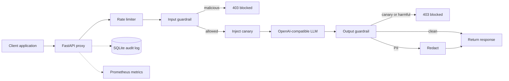

<div align="center">

# 🛡️ Aegis-ML

### An OpenAI-compatible firewall for LLM applications

Aegis classifies prompts before they reach a model, injects per-request canary
tokens, filters model output, and records every security decision.

[](https://github.com/hollowc2/Aegis-ML/actions/workflows/ci.yml)
[](https://huggingface.co/spaces/billybitcoin/aegis-ml)
[](https://www.python.org/)
[](LICENSE)

[Try the demo](https://huggingface.co/spaces/billybitcoin/aegis-ml) ·
[Read the threat model](docs/THREAT_MODEL.md) ·
[Review benchmarks](docs/BENCHMARKS.md)

</div>


## Why this project exists

An application cannot reliably defend against prompt injection by asking the
same model that is under attack to police itself. Aegis moves enforcement to a
separate service in front of the model:

```text
Client → rate limit → input classifier → canary injection → LLM
                                                     ↓
Client ← audit log ← output filtering ← canary check
```

Clients use the familiar `POST /v1/chat/completions` interface and change only
their base URL. A blocked input never reaches the backend model.

## What it demonstrates

- **Layered security:** ML input classification, canary leak detection, PII
  redaction, harmful-output filtering, and fail-secure behavior.
- **Production-oriented Python:** FastAPI, async HTTP forwarding, Pydantic
  configuration, SQLite audit logs, Prometheus metrics, and rate limiting.
- **An end-to-end ML lifecycle:** dataset preparation, baseline training,
  transformer fine-tuning, threshold analysis, multi-task classification, and
  INT8 ONNX export.
- **Operational packaging:** locked dependencies, Docker, Compose, automated
  tests, linting, and a hosted Gradio demonstration.

## See it in 30 seconds

Open the [live demo](https://huggingface.co/spaces/billybitcoin/aegis-ml), select
an attack example, and submit it. The analysis panel shows the classifier,
verdict, confidence, and latency. Benign responses are simulated in demo mode;
the full API mode forwards allowed requests to an OpenAI-compatible backend.

The demo lists only classifiers whose artifacts are loaded. If a model fails to
load, any heuristic fallback is explicitly labeled and must not be interpreted
as an ML model score.

## Architecture


```mermaid
flowchart LR
    Client[Client application] --> API[FastAPI proxy]
    API --> Limit[Rate limiter]
    Limit --> Input[Input guardrail]
    Input -->|malicious| BlockIn[403 blocked]
    Input -->|allowed| Canary[Inject canary]
    Canary --> LLM[OpenAI-compatible LLM]
    LLM --> Output[Output guardrail]
    Output -->|canary or harmful| BlockOut[403 blocked]
    Output -->|PII| Redact[Redact]
    Output -->|clean| Return[Return response]
    Redact --> Return
    API -.-> Audit[(SQLite audit log)]
    API -.-> Metrics[Prometheus metrics]
```

Every input-classifier exception results in a block. Unknown backend failures
are returned as `502` errors rather than being treated as safe model output.
See [the threat model](docs/THREAT_MODEL.md) for trust boundaries and known
limitations.

## Classifier implementations

| Stage | Implementation | Purpose | Artifact availability |
|---|---|---|---|
| Phase 1 | TF-IDF + logistic regression | Lightweight baseline and fast path | Bundled |
| Phase 2 | DistilBERT or DeBERTa-v3-small | Semantic binary classification | Train/export separately |
| Phase 3 | Multi-task DeBERTa-v3-base | Binary verdict plus 15 threat categories | Train/export separately |
| Cascade | sklearn → ONNX | Escalate ambiguous prompts to a neural model | Requires ONNX artifact |

The Phase 1 evaluation reproduces **0.9735 F1**, **0.9982 ROC-AUC**,
**0.31% FPR**, and **4.87% FNR** on a fixed 2,586-row test split at a `0.70`
threshold. Recorded latency was approximately `0.2 ms/sample` on the
development machine.
Hardware-dependent latency is illustrative, and Phase 2/3 numbers are not
published here until their artifacts and results can be reproduced. Full
methodology and caveats are in [docs/BENCHMARKS.md](docs/BENCHMARKS.md).

## Quick start

### Requirements

- Python 3.11 or 3.12
- [uv](https://docs.astral.sh/uv/)

```bash
git clone https://github.com/hollowc2/Aegis-ML.git
cd Aegis-ML
uv sync --locked
```

Run the local classifier demo:

```bash
uv run aegis-demo
# http://localhost:7860
```

Run the complete proxy:

```bash
cp .env.example .env
# Set BACKEND_URL in .env to your OpenAI-compatible model endpoint.
uv run aegis-serve
# http://localhost:8000
```

Test a benign request:

```bash
curl http://localhost:8000/v1/chat/completions \
  -H "Content-Type: application/json" \
  -d '{
    "model": "local-model",
    "messages": [{"role": "user", "content": "Explain TCP in one sentence."}]
  }'
```

## API surface

| Endpoint | Purpose |
|---|---|
| `POST /v1/chat/completions` | Guarded OpenAI-compatible chat completion |
| `GET /health` | Service and classifier readiness |
| `GET /metrics` | Prometheus metrics |
| `GET /audit/logs?limit=50` | Recent security decisions |

Example blocked response:

```json
{
  "error": {
    "message": "Request blocked by Aegis-ML guardrails.",
    "type": "guardrail_violation",
    "code": "prompt_injection_detected"
  }
}
```

## Configuration

Copy `.env.example` to `.env`. Common settings:

| Variable | Default | Description |
|---|---:|---|
| `BACKEND_URL` | `http://localhost:8080/v1/chat/completions` | Backend model endpoint |
| `CLASSIFIER_TYPE` | `sklearn` | `sklearn`, `hf`, `onnx`, `cascade`, `hf2`, `onnx2`, or `cascade2` |
| `CONFIDENCE_THRESHOLD` | `0.70` | Block at or above this malicious probability |
| `RATE_LIMIT_PER_MINUTE` | `60` | Per-IP request limit |
| `REDACT_PROMPTS_IN_LOGS` | `false` | Exclude prompt text from audit records |
| `DATABASE_URL` | `sqlite+aiosqlite:///./logs/aegis_audit.db` | Audit database |

The template documents model paths, cascade thresholds, preprocessing controls,
and service settings.

## Training and evaluation

Train and evaluate the bundled baseline:

```bash
uv run python -m training.data.prepare_dataset
uv run python -m training.phase1_sklearn.train
uv run python -m training.phase1_sklearn.evaluate --threshold 0.70
```

Install the heavier transformer toolchain only when needed:

```bash
uv sync --locked --extra hf2
uv run aegis-train-hf2 --epochs 12
uv run aegis-eval-hf2 --threshold 0.70
uv run aegis-export-hf2 --validate
```

GPU training is optional; the bundled baseline and default demo run on CPU.

## Development

```bash
uv sync --locked --extra dev
uv run ruff check app demo tests
uv run pytest
uv run pytest --cov=app --cov=demo --cov-report=html
```

Adversarial model regression tests are opt-in because they require a selected
model artifact:

```bash
RUN_ADVERSARIAL_TESTS=1 CLASSIFIER_TYPE=sklearn uv run pytest \
  tests/test_adversarial_regression.py -v
```

CI runs linting, unit/integration tests, and coverage checks on Python 3.11.

## Docker

```bash
docker build -t aegis-ml .
docker run --rm -p 8000:8000 \
  -e BACKEND_URL=http://host.docker.internal:8080/v1/chat/completions \
  aegis-ml
```

Or start the proxy and demo together:

```bash
docker compose up --build
```

## Repository map

```text
app/                  FastAPI service, classifiers, guardrails, proxy, database
demo/                 Gradio portfolio demo
training/             Dataset, training, evaluation, and ONNX export pipelines
tests/                Unit, integration, preprocessing, and adversarial tests
notebooks/            Recorded baseline analysis and generated plots
docs/                 Benchmarks, threat model, and project documentation
models/               Bundled sklearn artifact; larger artifacts are ignored
```

## Limitations

Aegis reduces risk; it does not prove that an input or output is safe.
Classifiers can be evaded, regex redaction is incomplete, and the in-memory
canary store is intended for a single worker. Multi-process deployments require
a shared canary store, and the audit endpoint needs authentication before
exposure to untrusted networks. More detail is documented in
[docs/THREAT_MODEL.md](docs/THREAT_MODEL.md).

## License

Released under the [MIT License](LICENSE).
